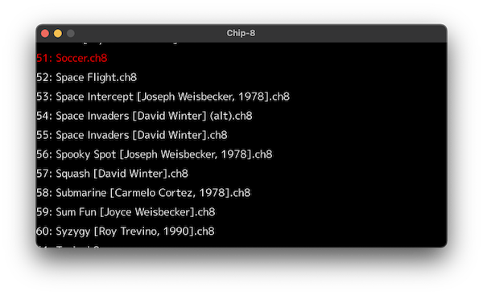
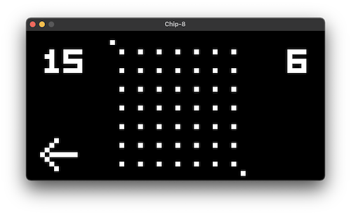
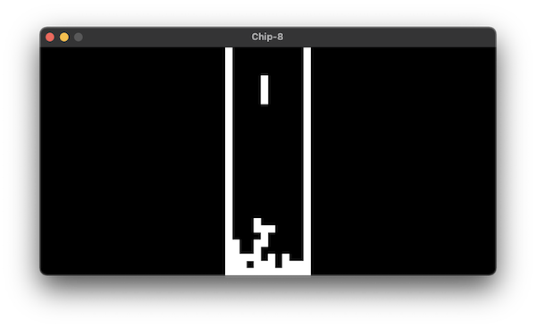
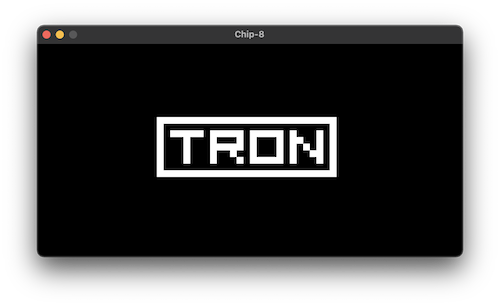
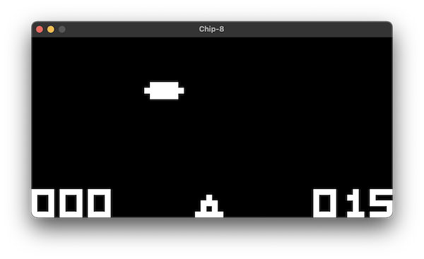

# Ghip8

[Chip8](https://en.wikipedia.org/wiki/CHIP-8) emulator written in Go with many game ROMs included.








## Run

1. Install [glfw dependencies](https://github.com/go-gl/glfw#installation)
2. Run:

```
go run .
```

## Usage

1. Select a ROM to play on the menu screen.
2. Enjoy.

## Key mapping

Chip8 has 4x4 keypad which key mapping is like this:

```
123C
456D
789E
A0BF
```

This is mapped to your qwerty keyboard like this:

```
1234
QWER
ASDF
ZXCV
```

`ESC` quits the emulator (on the menu screen) or the current game (on the game screen).
